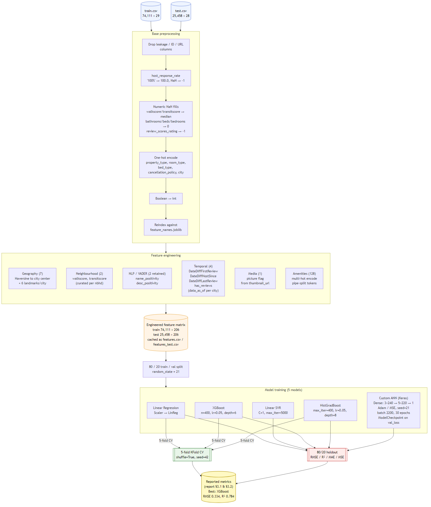

# Airbnb Price Prediction — CS6140 Final Project

Predicts the **log-price** of Airbnb listings across six U.S. cities (Boston, NYC, LA, SF, Chicago, DC) using the Deloitte ML Competition Kaggle dataset. We compare five regression models and report validation metrics plus test-set predictions.

---

## For the TA — how to evaluate this project (please read first)

> **Please run `TA_evaluation_run.ipynb`.**
>
> This single notebook reproduces every reported number:
> - Loads the pre-saved models from `saved/models/`
> - Computes validation metrics (RMSE / R² / MAE / MSE) for all 5 models on the held-out split
>
> **Runs locally, CPU only — no GPU required.** Expected wall-clock time: ~2–3 minutes end-to-end on a typical laptop.


That's it. No separate training run, no Colab upload, no GPU.

The training notebook (`Airbnb_modeling_CS6140_ML.ipynb`) consists of feature engineering, cross validation training and Artificial Neural Network definition & training. It takes significantly longer to run and is only useful to want to reproduce the model artifacts from scratch.

---

## Project overview

We treat price prediction as a **regression problem** on `log_price`. The dataset (Deloitte / Kaggle) is split:

| Split | Rows | Columns | Target |
|---|---|---|---|
| Train | 74,111 | 29 | `log_price` |
| Test  | 25,458 | 28 | (hidden) |

Column types in the raw data: 1 boolean, 7 float, 3 integer, 18 object/string. Features include number of rooms, bathrooms, reviews, accommodations, city, room type, property type, neighbourhood, bed type, amenities, cancellation policy, cleaning fee, description, first/last review dates, host profile data, lat/long, listing name, thumbnail URL, review scores, and zipcode.

Because the test set has no `log_price`, we do **not** compute metrics on it — only on a held-out 20% of train. 

---

## Pipeline overview



## Feature engineering

Performed once in `Airbnb_modeling_CS6140_ML.ipynb` and cached to `data/engineered/`.

| Group | Added features |
|---|---|
| Location | Haversine distance to city center + 6 major tourist attractions per city (7 features) |
| Neighborhood | Manually curated `walkscore`, `transitscore` per neighborhood |
| Text / NLP | VADER sentiment on `name` and `description` — compound / neg / neu / pos (8 features) |
| Temporal | `DateDiffFirstReview`, `DateDiffHostSince`, `DateDiffLastReview`, `has_reviews` — inferring scrape date per city from max `last_review` |
| Media | `picture` binary flag derived from `thumbnail_url` |
| Amenities | Raw `{...}` string parsed → ~130 boolean columns, one per unique amenity |

### Preprocessing pipeline

1. Drop leakage-prone / irrelevant columns
2. Normalize `host_response_rate` (`"100%"` → `100.0`, NaN → `-1` sentinel)
3. Median / sentinel fills for remaining numeric NaNs
4. One-hot encoding for nominal categoricals with modest cardinality: `property_type`, `room_type`, `bed_type`, `cancellation_policy`, `city`
5. Bool → int
6. Column reindex against the saved `feature_names.joblib` so train and test matrices are perfectly aligned

The final matrix has **206 numeric features**.

---

## Models & results

Validation split: 20% held out from `train.csv` with `random_state=21`.

| Model | RMSE | R² | MAE | Notes |
|---|---|---|---|---|
| HistGradBoost | 0.345 | 0.768 | 0.252 | sklearn's histogram boosting |
| **XGBoost** | **~0.334** | **~0.784** | **~0.24** | Also best CV score — strongest generalizer |
| ANN | 0.384 | 0.713 | 0.284 | 8 hidden Dense layers (3×240 → 5×220, ReLU) + Adam/MSE |
| LinearRegression | 0.435 | 0.633 | 0.322 | scaled inside a sklearn Pipeline |
| LinearSVR | 0.441 | 0.621 | 0.320 | LinearSVR used in place of kernel SVR for scalability on 74K rows |

Reported CV scores (5-fold, same random seed) from the training notebook (Linear SVR and ANN did not undergo cross validation training):

| Model | RMSE ± std | R² ± std |
|---|---|---|
| LinearRegression | 0.4358 ± 0.0032 | 0.6310 ± 0.0036 |
| XGBoost | 0.3716 ± 0.003 | 0.7315 ± 0.0041 |
| HistGradBoost | 0.3732 ± 0.0030 | 0.7293 ± 0.0043 |


CV scores are the **honest generalization estimates**. Validation-split scores for the full-data refit models show some in-sample inflation, which is discussed in the eval notebook.

---

## Repository layout

```
.
├── README.md
├── notes.md                        # technical details & results
├── requirements.txt
├── TA_evaluation_run.ipynb          <-- RUN THIS ONE FOR GRADING
├── Airbnb_modeling_CS6140_ML.ipynb  # full training notebook with feature engineering
│
├── docs/pictures/*                  # saved pictures
│
├── data/
│   ├── raw/
│   │   ├── train.csv                # Deloitte Kaggle data
│   │   └── test.csv
│   └── engineered/
│       ├── features.csv             # train after feature engineering
│       └── features_test.csv        # test  after feature engineering
│
└── saved/
    ├── feature_names.joblib         # canonical column order
    └── models/
        ├── model_linreg.joblib
        ├── model_xgb.joblib
        ├── model_histgb.joblib
        ├── model_linsvr.joblib
        ├── model_ann.keras          # Keras 3 native format
        └── scaler_ann.joblib        # StandardScaler used by the ANN
```

---

## Dependencies

All CPU. Tested on Python 3.12.

```
numpy
pandas
scikit-learn>=1.5
xgboost>=2.0
tensorflow>=2.15   # needed only to load the ANN
joblib
matplotlib
seaborn
nltk               # only for rerunning feature engineering
folium             # optional, for map visualizations
matplotlib
```

A minimal `requirements.txt` is included. No CUDA, no GPU drivers required. TensorFlow runs on CPU for the small ANN used here.

---

## Contributions
- Vaibhav Thalanki - Feature Engineering, ANN definition and training.
- Ananya Hegde - XGBoost & SVR training, and Test set evaluation.
- Rahul Kulkarni - Exploratory Data Analysis, Preprocessing and Linear regression training.


## References

- [1] R. Mizrahi, Airbnb Listings in Major U.S. Cities (Deloitte Machine Learning Competition), Kaggle Dataset, 2018. Available: [Airbnb Listings Dataset](https://www.kaggle.com/datasets/rudymizrahi/airbnb-listings-in-major-us-cities-deloitte-ml/data)

- [2] Hutto, C.J. & Gilbert, E.E. (2014). VADER: A Parsimonious Rule-based Model for Sentiment Analysis of Social Media Text. Eighth International Conference on Weblogs and Social Media (ICWSM-14). Ann Arbor, MI, June 2014.
