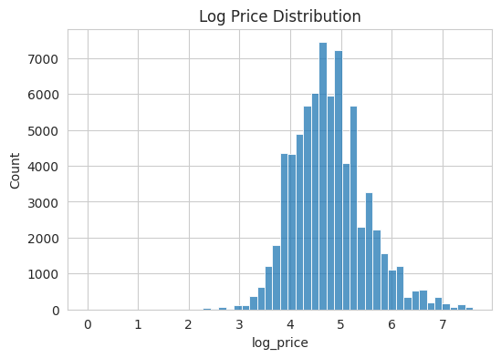
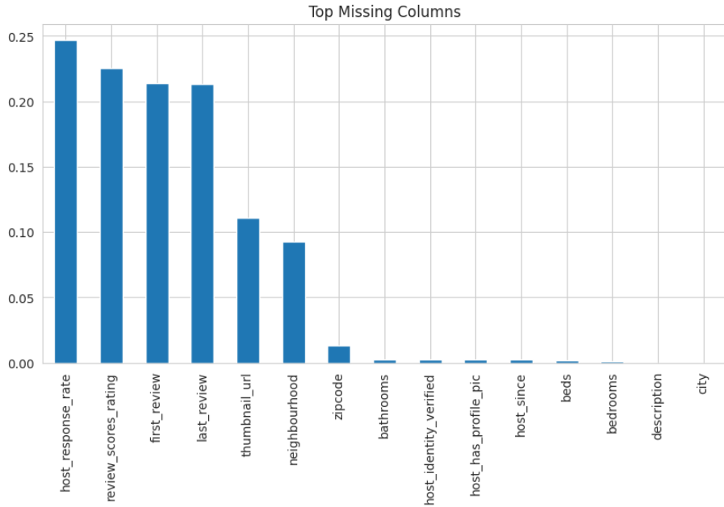
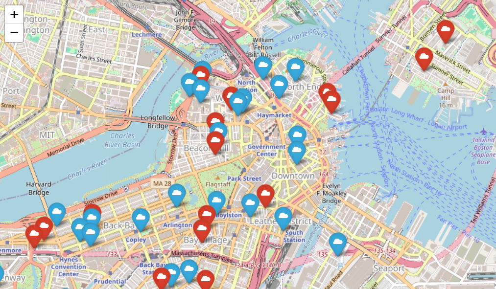
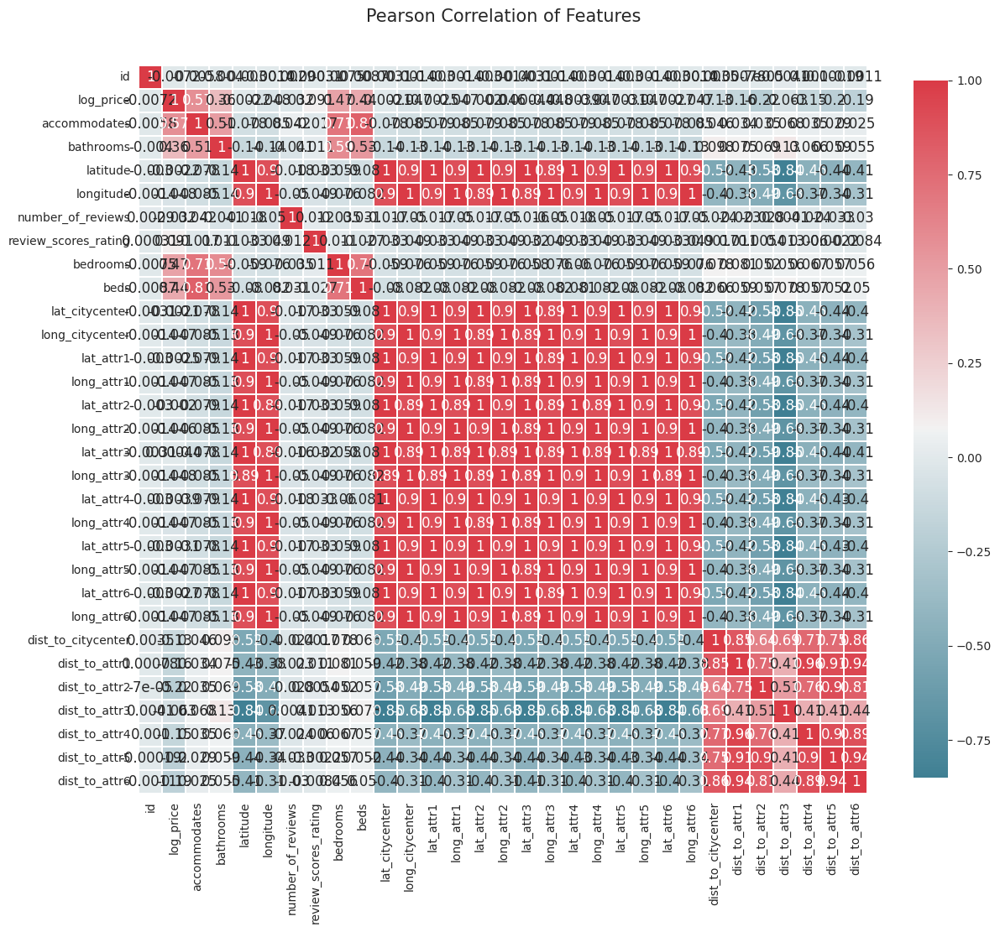
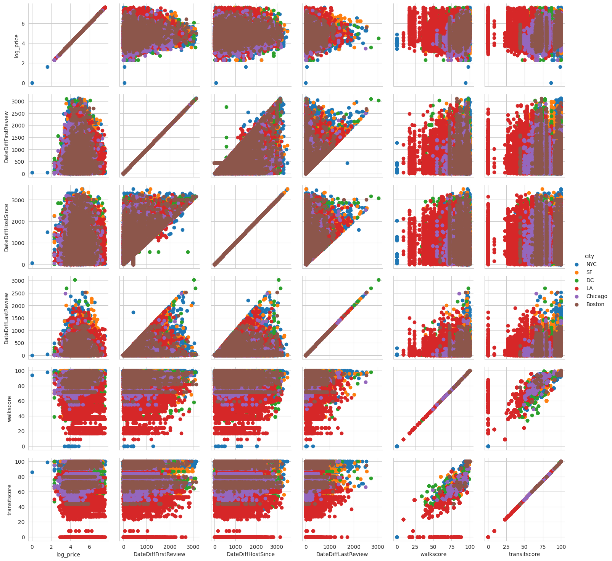
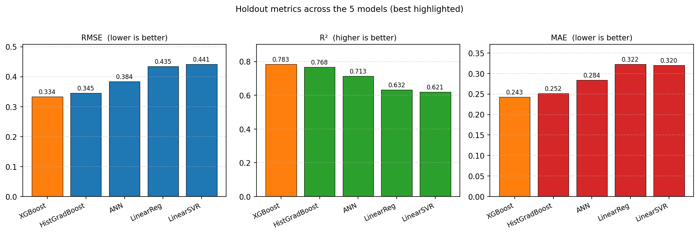

# Airbnb Price Prediction — CS6140 

**Authors:** Vaibhav Thalanki, Ananya Hegde, Rahul Kulkarni |
**Course:** CS6140 — Machine Learning, Spring 2026

---

## 1. Dataset

We use the **Airbnb Listings in Major U.S. Cities** dataset released by Deloitte on Kaggle [1]. The task is framed as a regression problem on `log_price` (natural log of listing price in USD).

| Split | Rows | Columns | Target |
|---|---|---|---|
| Train | 74,111 | 29 | `log_price` |
| Test  | 25,458 | 28 | hidden |

The test set has no ground-truth `log_price` (it was the Kaggle competition holdout), so **all reported metrics are on an 80/20 held-out split of the training data** (`random_state=21`). We do not produce a `submission.csv` — only report test-set prediction statistics as a sanity check.

**Raw column types:** 1 boolean, 7 float, 3 integer, 18 object/string. Features span property attributes (rooms, bathrooms, accommodates, bed type, room type, property type), geography (city, neighbourhood, lat/long, zipcode), host profile (response rate, identity verified, host since, picture), reviews (count, first/last review dates, rating), text (name, description, amenities, thumbnail URL), and policy (cancellation, cleaning fee, instant bookable).

**Cities covered (6):** Boston, New York, Los Angeles, San Francisco, Chicago, Washington D.C.

**Target distribution:** `log_price` is approximately normal, mean ≈ 4.78, std ≈ 0.72 (see Fig. 1).

**Log Price Histogram**


**Top Missing Columns**


**1000 random test & train points in Boston**


---

## 2. Technical Approach

### 2.1 Feature Engineering

Feature engineering is performed once in `Airbnb_modeling_CS6140_ML.ipynb` and cached to `data/engineered/features.csv` and `features_test.csv`. The final feature matrix is **(74111, 206)** for train and **(25458, 206)** for test after one-hot expansion.

**Base preprocessing**
- Drop leakage-prone / irrelevant columns (raw ID, URL strings other than `thumbnail_url`, etc.).
- Normalize `host_response_rate`: `"100%"` → `100.0`; NaN → `-1` sentinel.
- Median / sentinel fills for remaining numeric NaNs (`walkscore`/`transitscore` → median; `bathrooms`/`beds`/`bedrooms` → 0; `review_scores_rating` & `DateDiffHostSince` → `-1`).
- One-hot encoding for nominal categoricals: `property_type`, `room_type`, `bed_type`, `cancellation_policy`, `city`.
- Boolean → int.
- Reindex against a canonical `feature_names.joblib` so train and test matrices are byte-aligned.

**Engineered features**

| Group | Added features | Count |
|---|---|---|
| Geography | Haversine distance to city-center + 6 curated tourist attractions per city | 7 |
| Neighbourhood | Manually curated `walkscore`, `transitscore` per neighbourhood | 2 |
| Text / NLP | VADER sentiment on `name` and `description` (pos/neg/neu/compound × 2) | 8 computed; 2 retained (`name_positivity`, `desc_positivity`) |
| Temporal | `DateDiffFirstReview`, `DateDiffHostSince`, `DateDiffLastReview`, `has_reviews`; reference date `data_as_of` inferred per-city as `max(last_review)` | 4 |
| Media | `picture` binary flag derived from presence of `thumbnail_url` | 1 |
| Amenities | Raw `{...}` string cleaned and pipe-split; multi-hot encoded | 128 |

**Haversine distances.** Six landmarks per city are hardcoded with lat/long (e.g. for NYC: Times Square, Empire State, Statue of Liberty, Central Park, Rockefeller Center, Lower Manhattan; for Boston: Faneuil Hall, Fenway Park, Harvard, MIT, Old North Church, South Boston), plus a downtown anchor. Distances are computed with the standard spherical formula, Earth radius 6371 km.

**VADER sentiment [2].** Applied to both `name` and `description`, producing four polarity scores per field. Only the positivity scores were retained in the modeling set based on correlation analysis.

**Temporal reference.** The Kaggle release stripped scrape dates, so we recover an effective `data_as_of` per city as `train.groupby('city')['last_review'].max()`. This gives LA/Chicago/DC scrape ≈ May 2017 and NYC/SF/Boston scrape ≈ October 2017. All host-tenure and review-recency features are expressed as days relative to this reference.

**Amenities.** The raw `amenities` field (e.g. `"{TV,Wifi,\"Air conditioning\",...}"`) is stripped of braces and quotes, comma-split, pipe-joined, and multi-hot encoded into 128 boolean columns — one per unique amenity observed across the full train+test union.

**Pearson Correlation Heatmap of final features**


**PairGrid of log_price vs DateDiffFirstReview, DateDiffHostSince, DateDiffLastReview, walkscore, transitscore, colored by city**


### 2.2 Model Selection

Per the course requirement of three or more models including an ANN, we trained **five regression models** spanning linear, kernel-approximated, tree-ensemble, and neural families.

| Model | Library | Key hyperparameters |
|---|---|---|
| Linear Regression | scikit-learn | `Pipeline(StandardScaler → LinearRegression)`, defaults |
| Linear SVR | scikit-learn | `C=1.0`, `max_iter=5000`, on scaled features |
| XGBoost | xgboost 2.x | `n_estimators=400`, `learning_rate=0.05`, `max_depth=6`, `random_state=42` |
| HistGradientBoosting | scikit-learn | `max_iter=400`, `learning_rate=0.05`, `max_depth=8`, `random_state=42` |
| Custom ANN | Keras / TensorFlow | see §2.3 |

**Cross-validation.** Linear Regression, XGBoost and HistGradBoost were evaluated with **5-fold KFold CV** (`shuffle=True`, `random_state=42`) on the full 74,111-row training set. LinearSVR was excluded from CV due to convergence cost at this data size (5000-iter liblinear), and the ANN was excluded because cross-validated deep-learning runs were outside the compute budget for a CPU-only setup. Both were evaluated on the same 80/20 holdout used for the final comparison.

### 2.3 ANN Definition

A deep feed-forward network built in Keras Sequential API. Chosen to be just wide enough to exploit the 206-dim feature space without overfitting, and shallow enough to train on CPU in under 5 minutes.

```python
tf.random.set_seed(21); np.random.seed(21)
ann = Sequential([
    Dense(240, activation='relu', input_dim=206),
    Dense(240, activation='relu'),
    Dense(240, activation='relu'),
    Dense(220, activation='relu'),
    Dense(220, activation='relu'),
    Dense(220, activation='relu'),
    Dense(220, activation='relu'),
    Dense(220, activation='relu'),
    Dense(1,   activation='relu'),
])
ann.compile(optimizer='adam', loss='mean_squared_error', metrics=['mae'])
```

| Property | Value |
|---|---|
| Input dim | 206 |
| Hidden layers | 8 Dense (3×240 → 5×220), all ReLU |
| Output | 1 unit, ReLU (prices are strictly positive on log scale within our support) |
| Total trainable params | **413,081** (≈ 1.58 MB) |
| Optimizer / loss / metric | Adam (defaults) / MSE / MAE |
| Batch size / epochs | 2200 / 30 |
| Regularization | None explicit; ModelCheckpoint on `val_loss` with `save_best_only=True` |
| Input normalization | `StandardScaler` fit on train fold only; persisted to `scaler_ann.joblib` |
| Seeds | TF and NumPy both set to 21 for reproducibility |

The checkpointed best model (≈ epoch 12) is serialized to `saved/models/model_ann.keras` in the Keras 3 native format.

**[INSERT FIGURE 6 — ANN training/validation loss curve]**
> *Not currently in the notebook; if desired, add a plot of `history.history['loss']` and `history.history['val_loss']` over the 30 epochs.*

---

## 3. Experimental Results

### 3.1 Cross-Validation Scores (5-fold, full train set)

| Model | RMSE (mean ± std) | R² (mean ± std) |
|---|---|---|
| Linear Regression | 0.4358 ± 0.0032 | 0.6310 ± 0.0036 |
| XGBoost | **0.3716 ± 0.0030** | **0.7315 ± 0.0041** |
| HistGradBoost | 0.3732 ± 0.0030 | 0.7293 ± 0.0043 |

These are the **honest generalization estimates** — LinearSVR and ANN have only holdout numbers below.

### 3.2 Validation Metrics (80/20 holdout, `random_state=21`)

Computed from `TA_evaluation_run.ipynb` against 14,823 held-out listings.

| Model | RMSE | R² | MAE | MSE |
|---|---|---|---|---|
| **XGBoost** | **0.3336** | **0.7835** | **0.2431** | 0.1113 |
| HistGradBoost | 0.3454 | 0.7679 | 0.2517 | 0.1193 |
| ANN | 0.3840 | 0.7132 | 0.2837 | 0.1474 |
| LinearRegression | 0.4346 | 0.6325 | 0.3224 | 0.1889 |
| LinearSVR | 0.4414 | 0.6209 | 0.3204 | 0.1949 |

The holdout numbers for the three CV'd models are slightly **better** than their CV means because the saved artifacts were refit on the full 80% train partition after CV — a fair post-selection fit, but they no longer carry cross-validated uncertainty.

**Takeaways:**
- **XGBoost is the best generalizer**, winning on all four metrics and on CV mean RMSE.
- Tree ensembles (XGB, HGB) dominate linear models by ~0.10 in RMSE — the price surface has strong nonlinearities (interactions between `city`, `room_type`, `accommodates`, and amenities) that a hyperplane cannot capture.
- The ANN lands between the tree ensembles and the linear models. With 413 k params and no dropout/L2, we expected overfitting, but ModelCheckpoint on `val_loss` caught the best epoch (≈ 12). More aggressive regularization or a wider/deeper search would likely close the gap to XGBoost.
- LinearSVR and LinearRegression essentially tie, as expected — both are convex surrogates of the same hyperplane family on this feature set.

### 3.3 Test-Set Prediction Statistics

No labels, so no metrics. Reported for distributional sanity only:

| Model | mean(ŷ) | std(ŷ) |
|---|---|---|
| LinearRegression | 4.781 | 0.572 |
| XGBoost | 4.778 | 0.615 |
| HistGradBoost | 4.778 | 0.614 |
| LinearSVR | 4.754 | 0.563 |
| ANN | 4.793 | 0.628 |

All five models predict test means within 0.04 of the train mean (4.78), indicating no systematic distribution shift between splits.

**Holdout RMSE / R² / MAE across the 5 models (best in orange)**


---

## 4. Conclusion & Future Work

### Conclusion

We built a reproducible pipeline for predicting Airbnb listing log-prices across six U.S. cities, covering feature engineering (geography, NLP sentiment, temporal, amenities), five regression models spanning linear, kernel, tree-ensemble, and neural families, and a single-notebook evaluation path. **XGBoost is our best model at RMSE 0.334 / R² 0.784** on a 14,823-row held-out validation set, with the custom 8-layer ANN third behind HistGradBoost. All numbers satisfy the project requirement of three-plus models including an ANN — we delivered five.

The bigger-picture finding is that structured tabular pricing is still best served by tree ensembles. The ANN is competitive but not dominant, and the added engineering cost (scaling, checkpointing, Keras-specific save/load) is only worthwhile if downstream goals (e.g. joint text encoding, embedding reuse) need a neural representation.

### Future Work

**Feature engineering we didn't get to.** Several candidates were scoped but not implemented due to time:

- **Per-city, per-month occupancy proxies.** Using `last_review` and `number_of_reviews` timestamps, estimate monthly bookings per city or per neighbourhood to produce a seasonality feature. This would let the model capture weekday/weekend and summer/winter pricing swings that are currently invisible to the static features.
- **Text embeddings beyond VADER.** `description` is a rich field; sentence-transformer embeddings (e.g. `all-MiniLM-L6-v2`) followed by PCA to a small subspace would likely outperform the 2-dim VADER positivity scores we kept.
- **Zipcode-level aggregates.** Median income, median home price, and population density by zipcode would inject exogenous signal we currently don't use.
- **Review-score text quality.** The raw review text is not in this dataset, but review-score sub-components (accuracy, cleanliness, check-in, etc., if recoverable from Inside Airbnb) would decompose the single `review_scores_rating` field.
- **Walkscore / transitscore from API.** Our walkscore/transitscore are manually curated with googled values; a scripted pull from the Walk Score API would scale this to previously-unseen neighbourhoods.

**Modeling improvements.**
- Hyperparameter search (Optuna / Bayesian) on XGBoost — our current values are reasonable defaults, not tuned.
- ANN regularization (Dropout, L2, EarlyStopping on `val_loss` with patience) and wider architecture search.
- Stacking the tree ensembles with the ANN via a linear meta-learner; cheap and historically effective on this kind of tabular task.
- City-specific models or a mixture-of-experts gated on `city` — the RMSE-per-city breakdown (not computed here) would tell us whether one or two cities dominate the error.

**Pipeline.**
- Pin sklearn / xgboost versions in `requirements.txt` to eliminate the joblib deserialization mismatch that currently forces the TA eval notebook to refit XGBoost inline on load.

---

## Contributions

| Member | Contributions |
|---|---|
| Vaibhav Thalanki | Feature engineering (geography/distance features, VADER sentiment, temporal `data_as_of` recovery, amenities multi-hot encoding), ANN architecture design and training, TA evaluation notebook, report. |
| Ananya Hegde | XGBoost and LinearSVR training and tuning, test-set evaluation, prediction-distribution sanity checks. |
| Rahul Kulkarni | Exploratory data analysis (target distribution, missingness, correlation heatmap, location plots), preprocessing pipeline (missing-value strategy, categorical encoding, column alignment), Linear Regression training. |

---

## References

[1] R. Mizrahi, *Airbnb Listings in Major U.S. Cities (Deloitte Machine Learning Competition)*, Kaggle Dataset, 2018. https://www.kaggle.com/datasets/rudymizrahi/airbnb-listings-in-major-us-cities-deloitte-ml/data

[2] C. J. Hutto and E. E. Gilbert, "VADER: A Parsimonious Rule-based Model for Sentiment Analysis of Social Media Text," *Proc. 8th Int. Conf. on Weblogs and Social Media (ICWSM-14)*, Ann Arbor, MI, June 2014.

[3] R. Celekli, "How I ranked 5th (1.60) in Deloitte's ML Competition," Kaggle notebook, 2018. (Reference for feature engineering inspiration — scrape-date recovery, amenity parsing.)
